 amiresponsive image

[Link of Live Project](https://)
#
# Introduction

# SHAPE

*SHAPE* is a fictional gym aiming to promote their outdoor workouts exercises. Due to COVID-19 restrictions gyms have been temporarily closed, leaving many of its clients with no options to workout. This site will target current clients, introducing a new area where they can login into their account. It will target also potential costumers, who are curious to know more details about the classes, location and more information about the trainers. 

#

# UX
## Ideal User Demographic
The ideal user of this website is:
- Current Costumers
- Potential Costumer

## User Stories

### *Current Costumer:*

- As a current costumer, I want to know the sessions schedule, so that I could possibly book a workout.

- As a current costumer, I want to have acess to my login access area, so that I can know all the details regarding my subscription.

- As a current costumer, I want to be able to contact the Trainers, so that I could ask for advice and recommendatios regarding the Sessions.

### *Potential Costumer:*

- As a potential costumer, I want to know what services this gym offers, so that I could possibly join.

- As a potential costumer, I want to be able to get in touch, so that I could ask a question or clarify any doubts.

- As a potential costumer, I want to be able to book a trial, so that I can experience SHAPE without compromise. 

- As a potential costumer, I would like to more about the Trainers, so that I can be familiarized with their background

- As a potential costumer, I want to know SHAPE's reviews, so that I know how were other experiences like

## Development Planes
In order to achieve a comprehensive and informative website User Experience methodology was implemented to help research and layout the project structure. 

## Strategy Plane

The main goal of this project is to create a responsive and informative website to reach SHAPE's costumers and potential costumers. It is of high importance to make an easy to navigate layout and only have the most relevant content displayed so the user has a quick and learning interaction. 

- ### *Roles:*
   - Current Costumers
   - Potential Costumers
   - People who workout Outdoors

- ### *Age Target:*
   - 25 to 50 years old

- ### *Personality:*
   - Enjoys challenges
   - Interested in fitness content
   - Likes to workout outdoors

- ### *Values:*
   - Goal-oriented
   - Active lifestyle
   - Seeking Self-Accomplishment and Growth

- ### *Lifestyles:*
   - Structured and routine like
   - Fast paced
   - Fitness enthusiastic

## Website Goals:

1. Introduce current clients to the new Login area and Blog
2. Communicate what type of workout and schedules the gym offers
3. Familiarize the Trainers with website visitors
4. Create a Blog area that is informative to users on fitness related articles
5. Build connection with the user 

- ### Website enables *SHAPE* to:
    - Have a presence online
    - Promote their services
    - Have a community platform
    - Possibly reach more users

 - ### Strategy Table
   - A Strategy table was created in order to determine the trade-off between *Importance* and *Viability/Feasibility*:

| Opportunity/Problem   | Importance    | Viability/Feasibility|
| ---------------------:| -------------:| --------------------:|
| Have a Presence Online| 5| 5||
| Increase Value Experience| 5| 4
| Communicate Services Offered| 5| 5|
| Display Informative Content| 4| 4|

## Scope Plane

A Scope was conducted in order to determine the Content and Features needed on the Website. 

- ### *Content Requirements:*
    - Introduce users to SHAPE
    - Promote classes and Introduce Trainers  
    - Indicate location of the classes
    - Ability for Users to Book a Trial
    - Contact details
    - Social links

- ### *Functionality Requirements:*
    - Responsive and easy to navigate layout
    - Simple and informative content 
    - Appealing design
    - Increase interaction with users
    - Call-to-Action effectiveness
#

## Structure
- The information architecture was organized in a hierarchial tree structure in order to ensure that users could navigate through the site with ease and efficiency, with the following results:
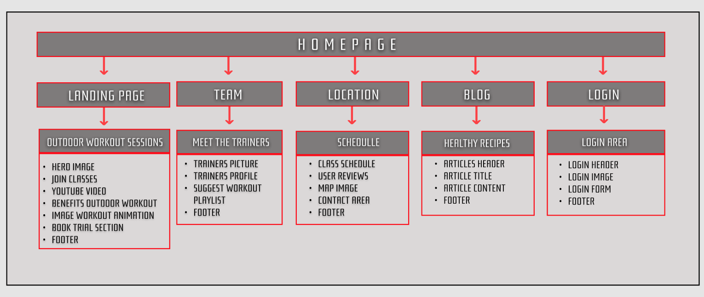
#

## Skeleton

- Wireframe mockups were created in a Figma Workspace with providing a positive user experience in mind:
[Wireframes]
#

## Design

### Colours
- The colours presented are the following: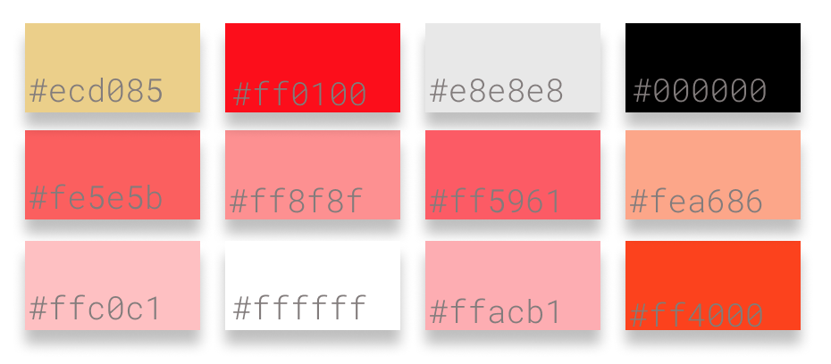

### Typography
- Two types of Google Fonts were importe:
  -  [Audiowide](https://fonts.google.com/specimen/Audiowide) was used for Headers content, having a bigger weight and bold feeling causing a contrast with the lightness of [Montserrat](https://fonts.google.com/specimen/Montserrat) which was used for main text content. 
#
# Features

## Existing Features

- ## Homepage 

- ### Navigation Bar
    - Featured on all five pages, the full responsive navigation bar includes links to the Logo, Home page, Trainers page (displayed as Team), Location page and  Login page. 
    - It is identical in each page to allow for easy navigation. This section will allow the user to easily navigate from page to page across all devices without having to revert back to the previous page via the ‘back’ button.
    - 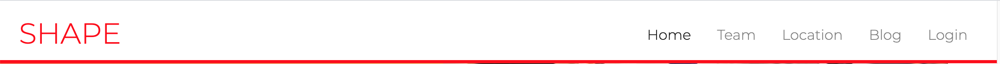

- ### Hero Image Section
    - This section introduces the user to SHAPE with an eye catching animation to grab their attention, includes a photograph with text overlay. 
    - A Call-to-Action for the user to Book a Trial.
    - 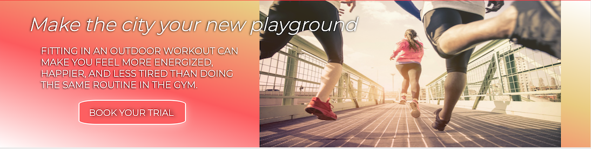

- ### Join Classes Section
   - This section is divided in 4 focal points:
   1. Introduction to SHAPE'S classes
   2. Introduction text to Outdoor Workout
   3. A illustrative Call-to-Action where hypothetically users would be guided to Ask any question regarding SHAPE
   4. A Youtube video of an Outdoor Workout represating what the classes hypothetically would be like
   - 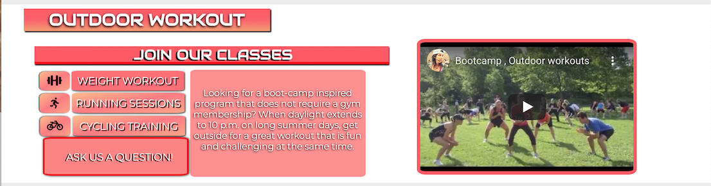

- ### Benefits Outdoor Section
   - This section is divided in 4 focal points:
   1. Informative text on Outdoor Workout;
   2. 4 Benefits of Outdoor Workout;
   3. A Call-to-Action where users who wish to know more about Outdoor Workout will be guided to the Blog Section;
   4. Fade-In Image animation with outdoor workout pictures;
   - 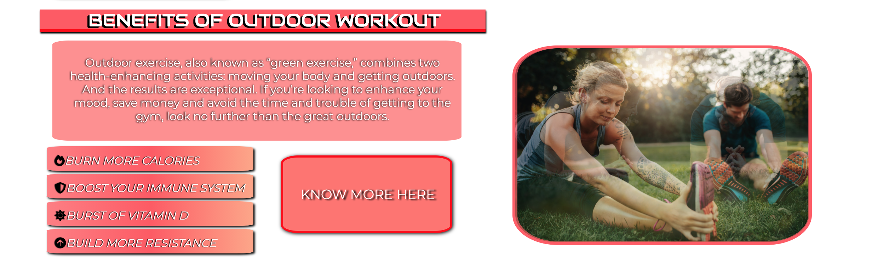

- ### Book Trial Section
   - This section is divided in 2 focal points:
   1. A form where the user can fill in details in order to have a trial at SHAPE;
   2. A promotional image;
   - 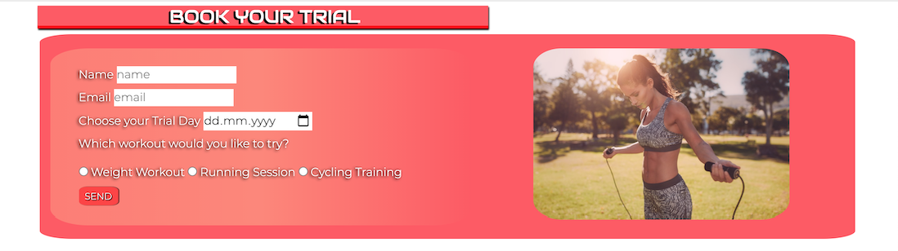

- ### Footer
   - The Footer has the same design and content in all pages of this website in order to keep a consistent look;
   - The footer is valuable to the user as it encourages them to keep connected via social media;
   
    INSERT FOOTER IMAGE

- ## Team Page

- TRAINERS PICTURE
- TRAINERS PROFILE
- SUGEGESTED WORKOUT PLAYLIST

- ## Location Page
   
- ### Classes Schedule & Reviews Section
   - This section is divided in 3 focal points:
   1. Informative text guiding the user to see the schedule below;
   2. A Schedule where the User can check the classes location, which type of exercise and the intensity of the class;
   3. A Review container animated by JavaScript, where users can get feedback from other users about SHAPE's services;
 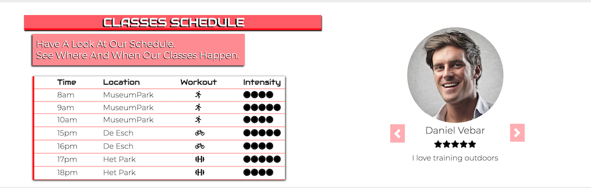

- ### Location & Contact Section
   - This section is divided in 2 focal points:
   1. An image of map  where as the classes would hypothetically occur as a visual aid for the user;
   2. An area where the User can get acess to SHAPE's email address;
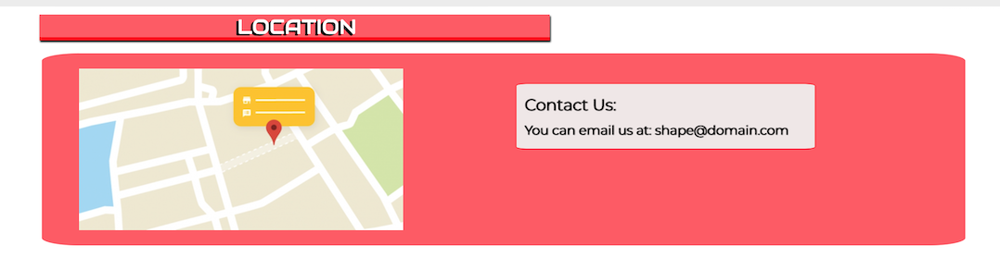

- ## Blog Page

- ### Articles Grid
    - This section is divided in 3 focal points:
    1. The Header;
    2. One row where two examples of articlea are shown;
    3. A second row where two other articles are displayed.
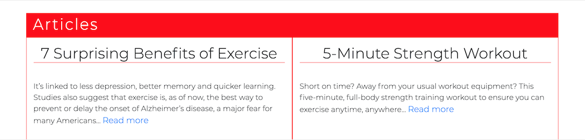
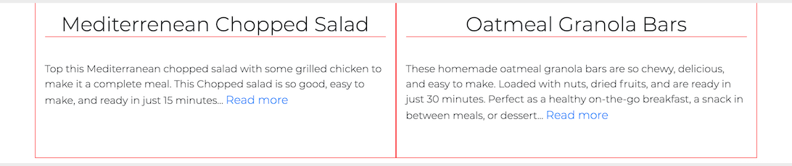

- ## Login Page

- ### Login Area
    - This section is composed by:
    1. A Heading with its Title.
    2. An promotional image.
    3. A form allowing the users to Login In and access their personal account.
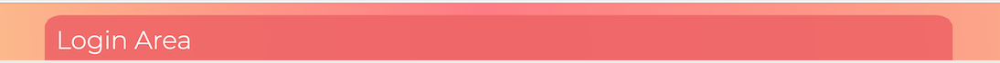
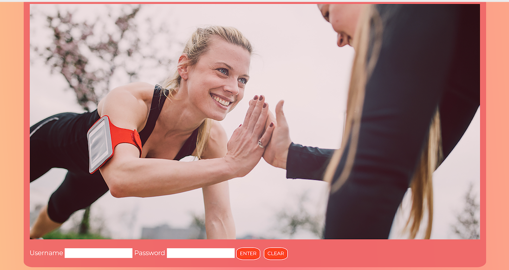
     

#### *Future Features*
....

#

# Issues and Bugs
....

#
# Technologies Used

### Main Languages Used

 
  - [HTML5](https://nl.wikipedia.org/wiki/HTML5) is a markup language used for structuring and presenting content on the World Wide Web.
  
  
  - [CSS3](https://en.wikipedia.org/wiki/CSS) is a style sheet language used for describing the presentation of a document written in a markup language such as HTML
  
 
  - [JavaScript](https://en.wikipedia.org/wiki/JavaScript) often abbreviated as JS, is a programming language that conforms to the ECMAScript specification.[9] JavaScript is high-level, often just-in-time compiled, and multi-paradigm. It has curly-bracket syntax, dynamic typing, prototype-based object-orientation, and first-class functions.

### Frameworks, Libraries & Programs Used
  
  - [Bootstrap4](https://getbootstrap.com/) used to help achieve responsiveness of the website.

 
  - [Google Fonts](https://fonts.google.com/) were imported and used for heading and body text.

  
  - [Font Awesome](https://fontawesome.com/)  icons were used to aid text content visusally. 

   
  - [Figma](https://www.figma.com/) to create Skeleton page and the Wireframes during the design phase of the project.

  [Am I Responsive](http://ami.responsivedesign.is/)
  - Used in order to see responsive design throughout the process and to generate mockup imagery to be used.

 ### Workspace, version control and Repository storage

   
  - [GitPod](https://gitpod.io) Main workspace IDE (Integrated Development Environment)

  
  - [Git](https://git-scm.com/) distributed Vgiersion Control tool to store versions of files and track changes.

   
  - [GitHub](https://github.com/) a cloud-based hosting service to manage my Git repositories.
#
# Testing

testing.md

#

# Deployment

### *Deploying on GitHub Pages*
#

### *Forking the Repository*
#

### *Creating a Clone*
#

#
# Credits

### *Content*
Since this is a fictional business idea, some content was taken from the web, mainly from other fitness websites in order for the project to look more credible. Link references of the content that was used are shown right below:

- ## Homepage
    - The Benefits of Outoor Workout Section was based on this [article](https://www.primalplay.com/blog/benefits-of-outdoor-exercise).
 
    - In the Hero Image animated text, the second part of the header is from this [article](https://www.shape.com/fitness/tips/outdoor-workout-study-physical-mental-benefits).

    - On the first section the Introduction text next to the Classes was taken from this [link](http://www.bodyresults.com/articles/outdoor-workout.asp).
 #

- ## Team Page

    -
    -
#

- ## Location Page

    - text

#

- ## Blog Page
    - The first article on the first row can be found [here](https://time.com/4474874/exercise-fitness-workouts/).
    - The second article show on the first can be found [here](https://www.everydayhealth.com/fitness/minute-full-body-strength-workout-with-kelsey-wells/).
    - The first article on the second row can be found [here]()
    - The second article on the second row can be found [here]()

#
### *Media*

- ## Images
    - Image used on Reviews section for female user found [here](https://www.google.com/search?q=picture%20woman%20round&tbm=isch&hl=nl&tbs=rimg:CSlh4_1KX7O82YU3FHiD3DS1i&sa=X&ved=0CBsQuIIBahcKEwio9tOnxKDwAhUAAAAAHQAAAAAQBw&biw=1265&bih=665#imgrc=nOZoA7r8oNnvwM).

    - Hero Image found [here](https://www.pennmedicine.org/updates/blogs/heart-and-vascular-blog/2017/february/do-you-need-a-heart-check-up-before-starting-an-exercise-program).
    
    - First image used on Fade animation found [here](https://blog.healthservicediscounts.com/should-you-ditch-sweaty-gyms-for-an-outdoor-workout/).
    
    - Second used on Fade animation found [here]((https://wirralview.com/covid-19-news/gym-goers-able-reinstate-memberships-outdoor-classes).

     - Image used for Book-a-Trial section found [here](https://skinnyms.com/fun-in-the-sun-outdoor-workout/).

     - Image used on Login Page found [here](https://www.shape.com/fitness/workouts/10-new-outdoor-workout-ideas).

     - Outdoor workout video found [here](https://www.youtube.com/watch?v=DLDlszsQUFg&t=21s).

     - Map Image on Location Page found [here](https://tmstools.co.th/sample-page/map-location-pin/).

     - Icons used can be found [here](https://fontawesome.com/).

     - [User 1](https://www.google.com/imgres?imgurl=http%3A%2F%2Fjoyfuljourneyhotsprings.com%2Fwp-content%2Fuploads%2F2013%2F07%2Fphotodune-4276142-smiling-portraits-xl_411.jpg&imgrefurl=http%3A%2F%2Fjoyfuljourneyhotsprings.com%2Fphotodune-4276142-smiling-portraits-xl_41%2F&tbnid=UvdalxaHs5escM&vet=10CBkQxiAoBWoXChMI-KX_hfiS8AIVAAAAAB0AAAAAEAI..i&docid=V3TPYEo3PZDusM&w=760&h=758&itg=1&q=face%20portrait%20smile&ved=0CBkQxiAoBWoXChMI-KX_hfiS8AIVAAAAAB0AAAAAEAI)) review &[ User 2](https://encrypted-tbn0.gstatic.com/images?q=tbn:ANd9GcSxijXW82ZpZwGVAhkTffY_nc5vcwTyb8kOF4LTm61EdX4PuQ6ZgDIBDMnePtN2qiR4IzI&usqp=CAU) review.
#

### *Code*
 - In this section you cand find all the links that helped and guided me in terms of Code used in order to achieve mostly the desired styling.
   
   - [Fade-In-Animation](http://css3.bradshawenterprises.com/cfimg/)

   - [Bootstrap Review Carousel](https://www.nicesnippets.com/snippet/bootstrap-4-testimonials-or-people-review-slider)

   - [Hero-Image Text Animation](https://thoughtbot.com/blog/css-animation-for-beginners)

   - [Gradient Styling](https://www.w3schools.com/css/tryit.asp?filename=trycss3_gradient-linear_trans)

   - [Text Shadow](https://www.w3schools.com/cssref/css3_pr_text-shadow.asp)

   - [Moving Text Animation](https://stackoverflow.com/questions/25717562/how-to-move-text-using-css-animation)

   - [Opacity Keyframes](https://css-tricks.com/snippets/css/keyframe-animation-syntax/)
#

# Acknowledgments

#

