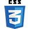

# [Table of contents](#table-of-contents)
### 1. [Introduction](#introduction)
### 2. [UX](#ux)
-  #### Ideal User Demographic
-  #### User Stories
-  #### Development Planes
-  #### Design
### 3. [Features](#features) 
-  #### Design Features
-  #### Existing Features
-  #### Future Features
### 4. [Issues and Bugs](#issues-and-bugs)
### 5. [Technologies Used](#technologies-used)
-  #### Main Languages Used
-  #### Additional Languages Used
-  #### Frameworks, Libraries & Programs Used
### 6. [Testing](#testing)
- #### Testing.md
### 7. [Deployment](#deployment)
- #### Deploying on GitHub Pages
- #### Forking the Repository
- #### Creating a Clone
### 8. [Credits](#credits)
- #### Content
- #### Media
- #### Code
## 9. [Acknowledgements](#acknowledgments)
#

# [Introduction](#introduction) 
Lorem ipsum dolor sit amet, consectetur adipiscing elit, sed do eiusmod tempor incididunt ut labore et dolore magna aliqua. Ut enim ad minim veniam, quis nostrud exercitation ullamco laboris nisi ut aliquip ex ea commodo consequat. Duis aute irure dolor in reprehenderit in voluptate velit esse cillum dolore eu fugiat nulla pariatur. Excepteur sint occaecat cupidatat non proident, sunt in culpa qui officia deserunt mollit anim id est laborum

[Back to Top&#8593;](#table-of-contents) 
#

# [UX](#ux)
## Ideal User Demographic
 The ideal user of this website is:
- Potential Costumers
- Current Costumers

## User Stories

#### Potential Costumer Goals:

- As a potential costumer, I want to know what services this gym offers, so that I could possibly join.

- As a potential costumer, I want to have access to the gym contacts, so that I could get in touch easily.

- As a potential costumer, I want to be able to Book a Trial, so that I can experience SHAPE first-hand without compremise. 

- As a potential costumer, I would like to know more about the Trainers beforehand, in order to know more about their background.

- As a potential costumer, I want to know what reviews SHAPE has, so that I know how were other experiences like.

#### Current Costumers Goals:

- As a current costumer, I want to information about the sessions, so that I could possibly book a workout.

- As a current costumer, I want to have acess to my login access area, so that I could check all the details related to my subscription.

- As a current costumer, I want to ...

- As a current costumer, I want to ...

- As a current costumer, I want to ... 

## Development Planes
Lorem ipsum dolor sit amet, consectetur adipiscing elit, sed do eiusmod tempor incididunt ut labore et dolore magna aliqua. Ut enim ad minim veniam, quis nostrud exercitation ullamco laboris nisi ut aliquip ex ea commodo consequat. Duis aute irure dolor in reprehenderit in voluptate velit esse cillum dolore eu fugiat nulla pariatur. Excepteur sint occaecat cupidatat non proident, sunt in culpa qui officia deserunt mollit anim id est laborum

### Strategy

Who will this website target/reach?

This website is built for those who are looking for outdoor exercice sessions. text text text

- #### Roles:
   - role1
   - role2
   - role3

- #### Demographics:
   - demo1
   - demo2
   - demo3

- ### Psychographics

- #### Personality & Attitudes:
   - text
   - text
   - text
   - text

- #### Values:
   - value1 
   - value2
   - value3
   - value4

- #### Lifestyles:
   - text
   - text
   - text 
   - text

### Website Goals:

#### The website needs to enable the user to:
- Know about what services are offered
- Inform about classes location and schedules
- Introduce Trainers to users

#### The website needs to enable SHAPE to:
- Promote their services
- text 
- text

### Scope

Content Requirements

The user will be looking for:

Functionality Requirements

The user will be able to:

### Structure

### Skeleton

[Wireframes]

### Design
Lorem ipsum dolor sit amet, consectetuer adipiscing elit. Aenean commodo ligula eget dolor. Aenean massa. Cum sociis natoque penatibus et magnis dis parturient montes, nascetur ridiculus mus. Donec quam felis, ultricies nec, pellentesque eu, pretium quis, sem. Nulla consequat massa quis enim. Donec pede justo 

#### Colours
Lorem ipsum dolor sit amet, consectetuer adipiscing elit. Aenean commodo ligula eget dolor. Aenean massa. Cum sociis natoque penatibus et magnis dis parturient montes, nascetur ridiculus mus. Donec quam felis, ultricies nec, pellentesque eu, pretium quis, sem. Nulla consequat massa quis enim. Donec pede justo 

#### Typography
Lorem ipsum dolor sit amet, consectetuer adipiscing elit. Aenean commodo ligula eget dolor. Aenean massa. Cum sociis natoque penatibus et magnis dis parturient montes, nascetur ridiculus mus. Donec quam felis, ultricies nec, pellentesque eu, pretium quis, sem. Nulla consequat massa quis enim. Donec pede justo 

#### Images
Lorem ipsum dolor sit amet, consectetuer adipiscing elit. Aenean commodo ligula eget dolor. Aenean massa. Cum sociis natoque penatibus et magnis dis parturient montes, nascetur ridiculus mus. Donec quam felis, ultricies nec, pellentesque eu, pretium quis, sem. Nulla consequat massa quis enim. Donec pede justo 

[Back to Top&#8593;](#table-of-contents) 
#

# [Features](#features)

#### Design Features
Lorem ipsum dolor sit amet, consectetuer adipiscing elit. Aenean commodo ligula eget dolor. Aenean massa. Cum sociis natoque penatibus et magnis dis parturient montes, nascetur ridiculus mus. Donec quam felis, ultricies nec, pellentesque eu, pretium quis, sem. Nulla consequat massa quis enim. Donec pede justo 

#### Existing Features
Lorem ipsum dolor sit amet, consectetuer adipiscing elit. Aenean commodo ligula eget dolor. Aenean massa. Cum sociis natoque penatibus et magnis dis parturient montes, nascetur ridiculus mus. Donec quam felis, ultricies nec, pellentesque eu, pretium quis, sem. Nulla consequat massa quis enim. Donec pede justo 

#### Future Features
Lorem ipsum dolor sit amet, consectetuer adipiscing elit. Aenean commodo ligula eget dolor. Aenean massa. Cum sociis natoque penatibus et magnis dis parturient montes, nascetur ridiculus mus. Donec quam felis, ultricies nec, pellentesque eu, pretium quis, sem. Nulla consequat massa quis enim. Donec pede justo 
[Back to Top&#8593;](#table-of-contents) 
#

# [Issues and Bugs](#issues-and-bugs)
Lorem ipsum dolor sit amet, consectetuer adipiscing elit. Aenean commodo ligula eget dolor. Aenean massa. Cum sociis natoque penatibus et magnis dis parturient montes, nascetur ridiculus mus. Donec quam felis, ultricies nec, pellentesque eu, pretium quis, sem. Nulla consequat massa quis enim. Donec pede justo, fringilla vel, aliquet nec, vulputate eget, arcu. In enim justo, rhoncus ut, imperdiet a, venenatis vitae, justo. Nullam dictum felis eu pede mollis pretium. Integer tincidunt. Cras dapibus. Vivamus elementum semper nisi. Aenean vulputate eleifend tellus. Aenean leo ligula, porttitor eu, consequat vitae, eleifend ac, enim. Aliquam lorem ante, dapibus in, viverra quis, feugiat a, tellus. Phasellus viverra nulla ut metus varius laoreet. Quisque rutrum. Aenean imperdiet. Etiam ultricies nisi vel augue. Curabitur ullamcorper ultricies nisi. Nam eget dui.
[Back to Top&#8593;](#table-of-contents) 
#

# [Technologies Used](#technologies-used)

#### Main Languages Used

-  [HTML5](https://nl.wikipedia.org/wiki/HTML5) links to wikipedia. short explanation about technology.

-  [CSS3](https://en.wikipedia.org/wiki/CSS) links to wikipedia. short explanation about technology.

#### Additional Languages Used

#### Frameworks, Libraries & Programs Used
[Bootstrap](https://getbootstrap.com/)
Bootstrap was used to implement the responsiveness of the site, using bootstrap classes.
Google Fonts
Google fonts was used to import the fonts "Roboto", "Lato" and "Montserrat" into the style.css file. These fonts were used throughout the project.
Font Awesome
Font Awesome was used on all pages throughout the website to import icons (e.g. social media icons) for UX purposes.
Git
Git was used for version control by utilizing the GitPod terminal to commit to Git and push to GitHub.
GitHub
GitHub was used to store the project after pushing
Figma
Figma was used to create the wireframes during the design phase of the project.
Am I Responsive?
Am I Responsive was used in order to see responsive design throughout the process and to generate mockup imagery to be used.
-  image [Bootstrap] links to wiki. short explanation.

- image [FontAwesome]  Icons for Social Media links in Footer.

- image [Google Fonts]  Overall Typography import.

3. Workspace, version control and Repository storage

- image [GitPod] - Main workspace IDE (Integrated Development Environment)

- mage [Git] - Distributed Version Control tool to store versions of files and track changes.

- image [GitHub] - A cloud-based hosting service to manage my Git repositories.

# [Testing](#testing)
[Back to Top&#8593;](#table-of-contents) 
#

# [Deployment](#deployment)
[Back to Top&#8593;](#table-of-contents) 
#

# [Credits](#credits)
[Back to Top&#8593;](#table-of-contents) 
#

# [Acknowledgments](#acknowledgments)
[Back to Top&#8593;](#table-of-contents) 
#
