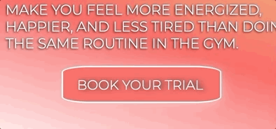
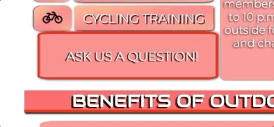
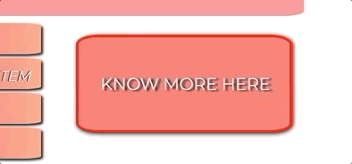
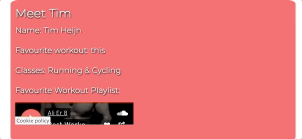
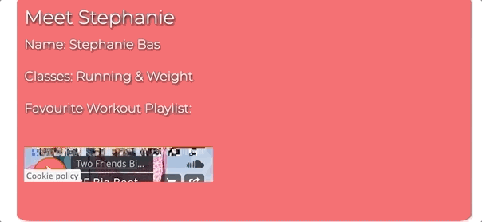
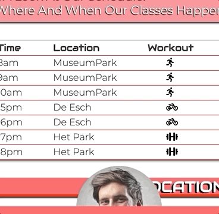

# Testing User Stories

## Current Costumer:
- As a current costumer, I want to know the sessions schedule, so that I could possibly book a workout.

     - The User will be able to find a schedule of the classes, on the Location Page.

-  As a current costumer, I want to have acess to my login access area, so that I can know all the details regarding my subscription.
     - The User will be able to find this section of the website on the header of each page as part of the navigation bar.

-  As a current costumer, I want to be able to contact the Trainers, so that I could ask for advice and recommendatios regarding the Sessions.
     - The User will be able to find the contact of each trainer on the Trainers Page.

## Potential Costumer:
-  As a potential costumer, I want to know what services this gym offers, so that I could possibly join.
    - The User will be able to find this information on the first section of the homepage.

-  As a potential costumer, I want to be able to get in touch, so that I could ask a question or clarify any doubts.
    - The User will be able to find this call-to-action button on the first section of the Homepage. The user will then be guided to complete a form below on the last section of the Homepage.

- As a potential costumer, I want to be able to book a trial, so that I can experience SHAPE without compromise.
    - The User will be able to do so, on the last section of the Homepage.

-  As a potential costumer, I would like to more about the Trainers, so that I can be familiarized with their background.
    - The User will be able to learn more about the trainers on the Trainers Page.

-  As a potential costumer, I want to know SHAPE's reviews, so that I know how were other experiences like.
    - The User will be able to find this information on the Location Page. A carousell will display the 3 different reviews about SHAPE.

# Manual Testing

### Homepage

- Testing on Hero Section:
   - Hero-Image Animation / Fade-In
   - Text Animation / Fade-In 

- Testing Hover Effect on:
   - Book a Trial Anchor:

 - Ask a Question Anchor:

- Know more Anchor:

- Testing Youtube Video Player:

- Testing Fade Image Animation:

- Testing Book a Trial Form:

- Homepage Responsiveness checked on:
     - 1440px screen
     - 1024px screen
     - 768px screen
     - 425px screen 
     - 375px screen
     
### Team Page

 - Testing Favourite Playlist on Male Trainer:

 

- Testing Favourite Playlist on Female Trainer:

- Team Page Responsiveness tested on:
     - 1440px screen
     - 1024px screen
     - 768px screen
     - 425px screen

### Location Page

- Testing Schedule Table Responsiveness:

- Testing Carousel:

- Location Page Responsiveness tested on:
     - 1440px screen
     - 1024px screen
     - 768px screen
     - 425px screen

### Blog Page

- Blog Page Responsiveness tested on:
    - 1440px screen
    - 1024px screen
    - 768px screen
    - 425px screen

### Login Page

- Testing Login Form:

- Login Page Responsiveness tested on:
    - 1440px screen
    - 1024px screen
    - 768px screen
    - 425px screen

### Footer

- Testing Social Links on Footer:

- Footer Responsiveness tested on:
    - 1440px screen
    - 1024px screen
    - 768px screen
    - 425px screen

# Automated Testing 

1. Code Validation

2. Browser Validation

3. Lighthouse Auditing

# User Testing